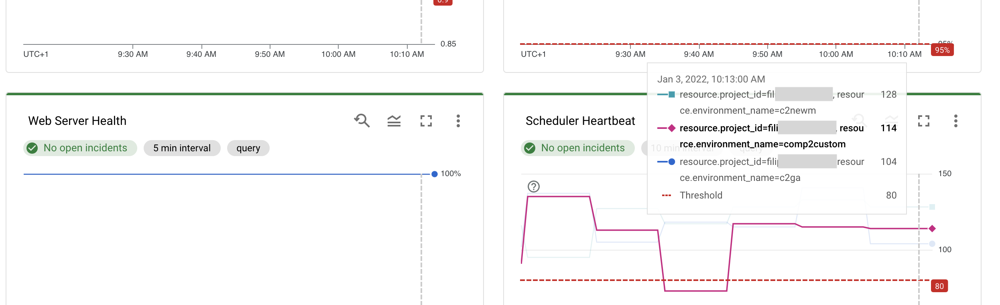

## Cloud Composer cross-project environment monitoring

### **The need**
This is an implementation of an integrated monitoring dashboard for multiple Cloud Composer environments, also across multiple project in the same organization. The solution presented here supports enterprise platform teams responsible for centralized  management of Cloud Composer environments used by other teams. 

### **How it works**
The process implements Google Cloud Monitoring Dashboard along with Alerting Policies that continously scan Cloud Composer environments and raise incidents in case of issues. The dashboard automatically scans all Cloud Composer environments in projects selected for this monitoring. Implementation relies on Terraform. 

The model uses a Google Cloud project acting as a Monitoring Project, used to monitor (read-only) Cloud Composer environments deployed in multiple Monitored Projects. The central dashboard uses Cloud Monitoring metrics from the Monitored Projects to render its contents. 

The process works fully with Cloud Composer 2; Cloud Composer 1 environments will miss few of the metrics and corresponding alerts (indicated below) due to architecture differences. 

The dashboard monitors and creates alerts for multiple metrics, including environment health:

or CPU metrics:

To see which environment a particular line represents, simply hover over it (it will display a project name and resource):

In case a metric exceeds a predefined threshold, an incident will be raised and respective alerts will be shown in a chart corresponding to this metric:

A complete list monitored metrics:
- Composer envrionment health (based on Monitoring DAG)
- Database health
- Web Server Health
- Scheduler Heartbeats
- CPU and Memory utilization for all Workers
- CPU and Memory utilization for the Airflow database
- CPU and Memory utilization for the Web Server (Composer 2 only)
- CPU and Memory utilization for Airflow Schedulers
- Proportion of Queued, Scheduled, Queued or Scheduled tasks in an envrionment (useful to spot Airflow concurrency configuration issues)
- DAG Parsing time
- Current vs minimal number of Workers - useful to understand Worker stability issues or scaling problems
- Worker Pod evictions
- Number of errors thrown in Logs by Workers, Schedulers, Web Server or other components (individual charts)

### **Implementation steps**
Follow these steps:
1. Create a new Cloud Composer project that will be used for the monitoring dashboard (Monitoring Project)
2. Clone this repository or copy main.tf to a local file system
3. Edit the main.tf file and update monitoring_project variable and monitored_projects set to the values for your projects
4. Ensure that GOOGLE_PROJECT environment variable holds the project ID of the Monitoring Project
5. Ensure that your Terraform Google provider is authenticated and has access to the following permissions:
      - roles/monitoring.editor permission in Monitoring Project
      - roles/monitoring.viewer, roles/logging.viewer in all Monitored Projects
7. Apply the Terraform configuration
8. Monitoring Dashboard is now available in Cloud Console, Monitoring Dashboards under "Cloud Composer - Monitoring Platform" name

There is no need to modify the dashboard when environments are added or deleted. Only addition or removal of Monitored Projects requires a modification and reapplication of the Terraform script. 

Any feedback to this model will be appreciated!
